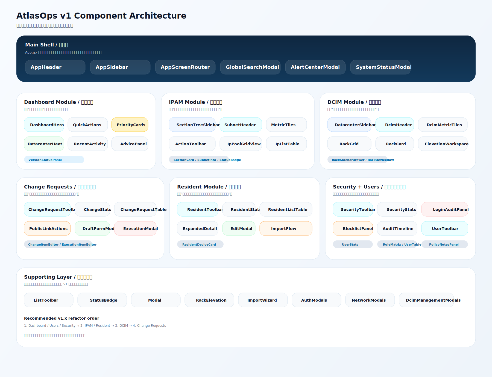
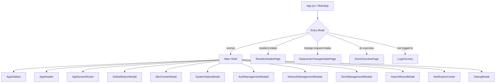
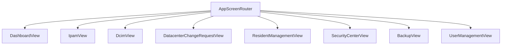

# V1 Component Architecture / v1 组件结构示意图

## Purpose / 目的

这份文档不是要求现在立刻把所有页面重构完，而是把 `v1` 当前可用版本的组件边界先画清楚。

这样后续如果你要把“每个功能单独做成一个组件”，可以按图逐步拆，不会一边拆一边把壳层、权限、跳转和状态管理打乱。

## Image / 图片版

下面这张图是可直接打开的图片版组件图：



单独打开图片文件：

- `docs/assets/v1-component-architecture.svg`

## Current Shell / 当前主壳层



## Routing / 路由级组件关系



## Shared Layer / 公共组件层

这些已经是比较稳定的共享层，建议继续沿用，不要在 v1 前反复改名字：

- `AppHeader`
- `AppSidebar`
- `AppScreenRouter`
- `GlobalSearchModal`
- `AlertCenterModal`
- `SystemStatusModal`
- `ListToolbar`
- `Modal`
- `StatusBadge`
- `RackElevation`
- `ImportWizardModal`

## Component Responsibilities / 组件职责

这一节对应的是“推荐拆分结构”里的组件职责。
其中有些组件是当前已经存在的页面内局部组件，有些是建议在 `v1.x` 逐步拆出来的目标组件。

### Core Shell / 主壳层

- `App.jsx / MainApp`
  负责入口模式判断、登录态管理、全局数据拉取、权限控制、模块切换、弹层编排和跨模块跳转。
- `AppHeader`
  展示当前工作区、全局搜索入口、告警入口、系统状态入口和个人操作。
- `AppSidebar`
  展示品牌、导航、当前用户上下文和版本摘要，是平台主导航壳。
- `AppScreenRouter`
  根据 `activeTab` 把请求分发到对应业务页面。
- `GlobalSearchModal`
  负责跨模块搜索、类型过滤、结果高亮和落地跳转。
- `AlertCenterModal`
  负责展示系统告警、忽略状态和告警跳转。
- `SystemStatusModal`
  负责展示前后端版本、构建信息、备份状态和数据质量摘要。
- `AuthManagementModals`
  负责登录后的密码修改、用户资料等认证相关弹层。
- `NetworkManagementModals`
  负责 IPAM 侧的分组、子网、地址编辑类弹层。
- `DcimManagementModals`
  负责机房、机柜、设备编辑类弹层。
- `ImportWizardModal`
  负责导入预览、字段确认和最终导入提交。
- `ListToolbar`
  负责页面标题、说明、搜索框、筛选控件、结果统计和主操作按钮这一套统一头部壳层。
- `Modal`
  提供统一弹层容器。
- `StatusBadge`
  提供统一状态色和状态标签。
- `RackElevation`
  负责机柜立面绘制、设备 U 位显示和只读/编辑态切换。

### Dashboard Module / 总览态势

- `DashboardView`
  当前总装页面，负责拼装首页各区块。
- `DashboardHero`
  负责首页第一屏的角色化说明、核心指标和品牌化引导。
- `QuickActionPanel`
  展示当前角色最常用的快捷入口。
- `PriorityCards`
  展示今天优先处理的待办，如异常设备、待审核、登录异常。
- `DatacenterHeatPanel`
  展示热点站点和高压力机房入口。
- `RecentActivityPanel`
  展示最近动作时间线。
- `AdvicePanel`
  把系统状态翻译成可执行建议。
- `VersionStatusPanel`
  展示前后端版本、备份和数据质量状态。

### IPAM Module / 网络地址

- `IpamView`
  当前 IPAM 总装页面，负责组织树、列表、地址池和顶部操作区。
- `SectionTreeSidebar`
  展示网络分组与子网树，用于快速切换范围。
- `SectionCard`
  表示单个网络分组及其子网折叠块。
- `SubnetWorkspaceHeader`
  展示当前子网标题、CIDR、说明和主操作。
- `SubnetMetricTiles`
  展示地址总数、在线数、保留数等关键指标。
- `SubnetActionToolbar`
  提供扫描、导入、导出、新增地址等动作。
- `SubnetMetaPanel`
  展示当前子网的说明信息和辅助字段。
- `IpPoolGridView`
  以地址池网格形式查看使用率和状态分布。
- `IpListTable`
  以表格查看具体地址条目、设备信息和操作按钮。

### DCIM Module / 机房设备

- `DcimView`
  当前 DCIM 总装页面，负责组合机房列表、机柜视图和设备详情抽屉。
- `DatacenterSidebar`
  展示机房列表和切换入口。
- `DatacenterListItem`
  表示单个机房卡片，展示机房名、位置和机柜数量。
- `DcimHeader`
  展示当前机房标题、视图切换、导入导出和新增机柜动作。
- `DcimMetricTiles`
  展示机柜数、设备数、规划功率、实际功率等指标。
- `RackGrid`
  展示机柜卡片集合。
- `RackCard`
  展示单个机柜的占用率、设备数、功率和快捷操作。
- `ElevationWorkspace`
  展示立面视图、缩放控制和机柜立面集合。
- `RackSidebarDrawer`
  展示选中机柜的详情抽屉。
- `RackDeviceRow`
  展示机柜中的单个设备条目。

### Change Requests / 设备变更申请

- `DatacenterChangeRequestView`
  当前变更申请总装页面，负责列表、草稿编辑、审批动作和执行回填。
- `ChangeRequestToolbar`
  展示申请页标题、搜索、状态筛选和结果统计。
- `ChangeStats`
  展示草稿、待审批、已完成等状态汇总。
- `ChangeRequestTable`
  展示申请列表和每条申请的操作入口。
- `PublicLinkActionGroup`
  负责复制链接、打开链接、设置有效期等公共补单动作。
- `DraftFormModal`
  负责新建和编辑草稿申请。
- `ChangeItemEditor`
  负责编辑单个设备变更项，包括机柜、U 位、IP 和备注。
- `ExecutionModal`
  负责审批通过后的执行回填。
- `ExecutionItemEditor`
  负责单条执行结果的回填与校正。

### Resident Module / 驻场运营

- `ResidentManagementView`
  当前驻场管理总装页面，负责列表、展开详情、编辑和导入导出。
- `ResidentToolbar`
  展示驻场页标题、搜索筛选、导入导出和登记入口。
- `ResidentStats`
  展示驻场人数、待审核人数、即将到期人数、待安排座位人数。
- `ResidentListTable`
  展示驻场人员主列表。
- `ResidentExpandedDetail`
  展示展开后的详细信息，包括设备、工位和审批状态。
- `ResidentDeviceCard`
  展示单个备案设备。
- `ResidentEditModal`
  负责驻场人员和设备信息编辑。
- `ResidentImportFlow`
  负责 Excel 导入和导入确认。
- `ResidentIntakePage`
  面向外部登记入口的独立页面，不建议和后台管理树混在一起。

### Security Module / 安全中心

- `SecurityCenterView`
  当前安全中心总装页面，负责登录审计、黑名单和审计轨迹三块内容。
- `SecurityToolbar`
  展示页面标题、统计摘要和危险动作入口。
- `SecurityStats`
  展示登录事件、异常登录、黑名单地址等数量。
- `LoginAuditPanel`
  展示登录记录和结果状态。
- `BlocklistPanel`
  展示封禁 IP、原因和解除动作。
- `AuditTimelinePanel`
  展示敏感操作审计时间线。

### Users Module / 平台管理

- `UserManagementView`
  当前用户管理总装页面，负责统计、角色矩阵、账号表和策略说明。
- `UserToolbar`
  展示页面标题、账号总数和创建用户入口。
- `UserStats`
  展示总账号、启用账号、待改密账号、锁定账号。
- `RoleMatrixPanel`
  展示角色标签、模块权限和职责说明。
- `UserTable`
  展示账号列表和账号级操作按钮。
- `UserActionButton`
  统一用户表里的启用、禁用、重置、解锁、删除按钮样式。
- `PolicyNotesPanel`
  展示账号启停、登录锁定和强制改密规则说明。

### Backup Module / 备份恢复

- `BackupView`
  当前备份页总装页面，负责手动备份、备份列表、恢复入口和健康摘要。
- `BackupToolbar`
  展示页面标题和主操作按钮。
- `BackupStats`
  展示备份数量、最近备份、状态摘要等。
- `BackupList`
  展示备份文件列表和下载操作。
- `BackupHealthPanel`
  展示保留策略、恢复信心和异常提醒。

## Recommended Split / 推荐拆分结构

下面这张图是“下一步拆组件”时最稳妥的拆法。
建议优先拆“页面内部的大块功能组件”，不要一开始就把每个按钮都拆成单独文件。

```mermaid
flowchart LR
  App[App.jsx]

  App --> Shell[Shell Components]
  Shell --> ShellA[AppHeader]
  Shell --> ShellB[AppSidebar]
  Shell --> ShellC[AppScreenRouter]
  Shell --> ShellD[GlobalSearchModal]
  Shell --> ShellE[AlertCenterModal]
  Shell --> ShellF[SystemStatusModal]

  App --> Dashboard[Dashboard Module]
  Dashboard --> DashboardA[DashboardHero]
  Dashboard --> DashboardB[QuickActionPanel]
  Dashboard --> DashboardC[PriorityCards]
  Dashboard --> DashboardD[DatacenterHeatPanel]
  Dashboard --> DashboardE[RecentActivityPanel]
  Dashboard --> DashboardF[AdvicePanel]
  Dashboard --> DashboardG[VersionStatusPanel]

  App --> Ipam[IPAM Module]
  Ipam --> IpamA[SectionTreeSidebar]
  Ipam --> IpamB[SubnetWorkspaceHeader]
  Ipam --> IpamC[SubnetMetricTiles]
  Ipam --> IpamD[SubnetActionToolbar]
  Ipam --> IpamE[IpPoolGridView]
  Ipam --> IpamF[IpListTable]

  App --> Dcim[DCIM Module]
  Dcim --> DcimA[DatacenterSidebar]
  Dcim --> DcimB[DcimHeader]
  Dcim --> DcimC[DcimMetricTiles]
  Dcim --> DcimD[RackGrid]
  Dcim --> DcimE[RackCard]
  Dcim --> DcimF[ElevationWorkspace]
  Dcim --> DcimG[RackSidebarDrawer]
  Dcim --> DcimH[RackDeviceRow]

  App --> Change[Change Request Module]
  Change --> ChangeA[ChangeRequestToolbar]
  Change --> ChangeB[ChangeStats]
  Change --> ChangeC[ChangeRequestTable]
  Change --> ChangeD[PublicLinkActionGroup]
  Change --> ChangeE[DraftFormModal]
  Change --> ChangeF[ExecutionModal]

  App --> Resident[Resident Module]
  Resident --> ResidentA[ResidentToolbar]
  Resident --> ResidentB[ResidentStats]
  Resident --> ResidentC[ResidentListTable]
  Resident --> ResidentD[ResidentRowDetail]
  Resident --> ResidentE[ResidentEditModal]
  Resident --> ResidentF[ResidentDeviceEditor]

  App --> Security[Security Module]
  Security --> SecurityA[SecurityToolbar]
  Security --> SecurityB[SecurityStats]
  Security --> SecurityC[LoginAuditPanel]
  Security --> SecurityD[BlocklistPanel]
  Security --> SecurityE[AuditTimelinePanel]

  App --> Users[User Module]
  Users --> UsersA[UserToolbar]
  Users --> UsersB[UserStats]
  Users --> UsersC[RoleMatrixPanel]
  Users --> UsersD[UserTable]
  Users --> UsersE[PolicyNotesPanel]

  App --> Backup[Backup Module]
  Backup --> BackupA[BackupToolbar]
  Backup --> BackupB[BackupStats]
  Backup --> BackupC[BackupList]
  Backup --> BackupD[BackupHealthPanel]
```



## Module-by-Module Sketch / 各模块示意图

### Dashboard

```text
DashboardView
├─ DashboardHero
├─ QuickActionPanel
├─ PriorityCards
├─ DatacenterHeatPanel
├─ RecentActivityPanel
├─ AdvicePanel
└─ VersionStatusPanel
```

说明：

- 当前 `DashboardView.jsx` 里已经有 `Panel`、`MetricBadge`、`SummaryTile`、`AdviceCard`、`VersionCard` 这些局部组件。
- 下一步最自然的拆法，是把每个业务区块抽成独立文件，而不是继续把所有块放在同一个页面文件里。

### IPAM

```text
IpamView
├─ SectionTreeSidebar
│  └─ SectionCard
├─ SubnetWorkspaceHeader
├─ SubnetMetricTiles
├─ SubnetActionToolbar
├─ SubnetMetaPanel
├─ IpPoolGridView
└─ IpListTable
```

说明：

- `IpamView.jsx` 现在已经具备典型的三段式结构，只差把左侧树、顶部工具区、内容区拆开。
- `ActionButton`、`MetricTile`、`SubnetInfo` 已经可以直接演化为共享或半共享组件。

### DCIM

```text
DcimView
├─ DatacenterSidebar
│  └─ DatacenterListItem
├─ DcimHeader
├─ DcimMetricTiles
├─ RackGrid
│  └─ RackCard
├─ ElevationWorkspace
│  └─ RackElevation
└─ RackSidebarDrawer
   └─ RackDeviceRow
```

说明：

- `DcimView.jsx` 当前功能最完整，但也最适合继续拆。
- 最推荐优先拆 `DatacenterSidebar`、`DcimHeader`、`RackGrid`、`RackSidebarDrawer` 这四块。

### Change Requests

```text
DatacenterChangeRequestView
├─ ChangeRequestToolbar
├─ ChangeStats
├─ ChangeRequestTable
│  └─ PublicLinkActionGroup
├─ DraftFormModal
│  └─ ChangeItemEditor[]
└─ ExecutionModal
   └─ ExecutionItemEditor[]
```

说明：

- 这是当前最重的业务页之一，建议按“列表区 / 草稿编辑区 / 执行回填区”三大块拆。
- 这页拆完以后，后续做权限、审批流、审计展示都会轻松很多。

### Resident

```text
ResidentManagementView
├─ ResidentToolbar
├─ ResidentStats
├─ ResidentListTable
├─ ResidentExpandedDetail
│  └─ ResidentDeviceCard[]
├─ ResidentEditModal
└─ ResidentImportFlow
```

说明：

- 驻场页目前业务字段很多，最适合先拆“详情展开区”和“编辑弹层”。
- `ResidentIntakePage` 建议独立保持一条公共登记链路，不要跟后台管理页混在同一组件树里。

### Security

```text
SecurityCenterView
├─ SecurityToolbar
├─ SecurityStats
├─ LoginAuditPanel
├─ BlocklistPanel
└─ AuditTimelinePanel
```

说明：

- 安全中心这页已经很接近标准三栏结构，拆法最直接。
- 这里的 `SummaryCard` 和 `Panel` 后面甚至可以抽成更通用的壳层组件。

### Users

```text
UserManagementView
├─ UserToolbar
├─ UserStats
├─ RoleMatrixPanel
├─ UserTable
└─ PolicyNotesPanel
```

说明：

- 用户页现在信息分区已经很清楚，拆分主要是为了维护性，不是为了功能补齐。
- `UserActionButton` 很适合保留在用户模块内部，先不要全局共用。

### Backup

```text
BackupView
├─ BackupToolbar
├─ BackupStats
├─ BackupList
└─ BackupHealthPanel
```

## Suggested Folder Layout / 建议目录结构

如果你后面真的开始按功能拆组件，我建议朝这个目录形态走：

```text
frontend/src/
├─ components/
│  ├─ common/
│  ├─ shell/
│  └─ feedback/
├─ modules/
│  ├─ dashboard/
│  │  ├─ components/
│  │  ├─ views/
│  │  └─ index.js
│  ├─ ipam/
│  │  ├─ components/
│  │  ├─ hooks/
│  │  ├─ views/
│  │  └─ index.js
│  ├─ dcim/
│  │  ├─ components/
│  │  ├─ hooks/
│  │  ├─ views/
│  │  └─ index.js
│  ├─ changeRequests/
│  │  ├─ components/
│  │  ├─ views/
│  │  └─ index.js
│  ├─ resident/
│  │  ├─ components/
│  │  ├─ views/
│  │  └─ index.js
│  ├─ security/
│  │  ├─ components/
│  │  ├─ views/
│  │  └─ index.js
│  ├─ users/
│  │  ├─ components/
│  │  ├─ views/
│  │  └─ index.js
│  └─ backup/
│     ├─ components/
│     ├─ views/
│     └─ index.js
```

## Refactor Order / 推荐拆分顺序

如果要在不影响 `v1` 稳定性的前提下继续拆组件，建议顺序如下：

1. 先拆 `dashboard`、`users`、`security`
2. 再拆 `ipam`、`resident`
3. 然后拆 `dcim`
4. 最后拆 `changeRequests`

原因：

- 前三者业务耦合更低，拆坏的风险最小。
- `dcim` 和 `changeRequests` 交互重、状态多，适合放后面。

## V1 Decision / v1 定版建议

我的建议是：

- 当前版本可以直接定为 `v1`
- 这份组件图作为 `v1` 之后的结构改造蓝图
- 不建议为了“先把每个功能都拆成独立组件”而推迟发版

更稳的做法是：

`v1 = 当前可用版本 + 组件边界文档确定`

`v1.x = 按文档逐步拆分组件，不改变业务行为`
