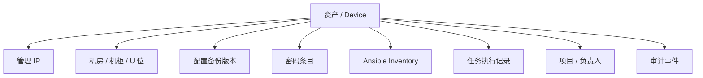

# V2 Asset Foundation / 资产中心设计

## 定位

V2 的资产中心不是旧式固定资产台账，也不是单纯的 IPAM 或 DCIM 页面。

它是全网运维控制台的基石，用来回答四个问题：

- 这台设备是谁，在哪里，怎么连？
- 它的配置有没有备份，最近一次是否成功？
- 它的账号密码是否可用、是否受控、是否即将过期？
- 它是否纳入 Ansible，最近执行过什么任务，结果如何？

资产中心应该成为配置备份、密码本、Ansible、任务中心的共同入口。

## 设计原则

- 资产是主对象，IP、机柜、密码、配置、任务都是资产的关联信息。
- 页面第一眼优先展示运维状态，不优先展示采购字段。
- 列表用于快速定位和判断风险，详情页用于处理一台设备。
- 不再把功能拆成很多平级模块，围绕资产详情把信息聚合起来。
- 先做全网设备资产，再扩展服务器、虚拟化、存储、安全设备等子类型。

## 主导航建议

V2 第一阶段主导航只保留：

- 总览
- 资产
- 配置备份
- 密码本
- 自动化
- 任务中心

系统管理、审计、用户权限放到右上角或后台入口，不占主工作区导航。

## 资产列表

资产列表是 V2 最重要的第一屏。它应该像运维驾驶舱里的设备清单，而不是表单数据库。

### 顶部摘要

- 全网资产数量
- 在线 / 离线 / 未检测数量
- 配置备份成功率
- 密码受控率
- Ansible 纳管率
- 今日失败任务数量

### 核心列

| 列 | 内容 |
| --- | --- |
| 资产 | 名称、主机名、管理 IP、设备类型 |
| 位置 | 区域、机房、机柜、U 位 |
| 运行状态 | 在线、离线、维护、退役、未检测 |
| 配置备份 | 最近备份时间、成功/失败、配置版本数 |
| 密码状态 | 已绑定、未绑定、即将过期、验证失败 |
| 自动化 | Ansible 纳管状态、Inventory 分组、最近任务 |
| 责任 | 项目、负责人、团队 |
| 风险 | 备份失败、密码过期、不可达、未纳管 |

### 筛选条件

- 关键字：名称、IP、序列号、资产编号、项目、负责人
- 类型：交换机、路由器、防火墙、服务器、存储、虚拟化、安全设备、其他
- 区域 / 机房 / 机柜
- 运行状态
- 配置备份状态
- 密码状态
- Ansible 状态
- 项目 / 团队
- 风险标签

### 视图模式

- 列表视图：默认视图，适合日常运维和筛选。
- 分组视图：按机房、类型、项目、Ansible 分组查看。
- 风险视图：只看未备份、密码异常、自动化失败、不可达设备。

## 资产详情页

资产详情页是所有能力的汇合点。用户点进一台设备后，不应该再跳到多个模块找信息。

### 顶部身份区

展示：

- 设备名称
- 管理 IP
- 设备类型
- 厂商 / 型号 / 系统版本
- 运行状态
- 位置
- 项目 / 负责人

主要操作：

- 立即备份配置
- 查看密码
- 执行 Ansible 任务
- 发起连通性检测
- 编辑资产

### 概览

用于快速判断这台设备是否健康：

- 最近配置备份
- 最近一次密码验证
- 最近一次 Ansible 执行
- 最近一次连通性检测
- 当前风险标签
- 关联 IP
- 关联机柜位置

### 配置备份

展示：

- 备份时间线
- 每个版本的备份状态
- 配置差异对比入口
- 下载配置
- 失败原因
- 触发备份按钮

MVP 阶段先做到“备份记录 + 最近状态 + 下载”，配置 Diff 可以第二阶段做。

### 密码

展示：

- 绑定的账号条目
- 账号类型：SSH、enable、Web、API Token、SNMP
- 敏感级别
- 最近验证时间
- 到期时间
- 查看密码审计记录

密码明文不在资产详情直接裸露，必须走确认、权限和审计。

### 自动化

展示：

- 是否纳入 Ansible
- Inventory 主机名
- 所属分组
- host_vars / group_vars 摘要
- 最近执行记录
- 可执行 Playbook 或任务模板

第一阶段重点是“纳管状态 + 执行记录”，不要一开始做复杂编排。

### 关系

资产关系用于替代旧系统里分散的模块跳转：



### 操作记录

展示这台资产发生过什么：

- 创建 / 修改资产
- 触发配置备份
- 查看密码
- 执行自动化任务
- 任务失败
- 配置变更
- 状态检测变化

## 资产对象建议

第一阶段可以先不大改数据库，用聚合层把现有 `RackDevice`、`IPAddress`、`SecretRecord` 等数据拼成资产视图。

长期建议形成一个真正的资产主对象：

```json
{
  "id": 1,
  "name": "core-sw-01",
  "asset_type": "switch",
  "vendor": "Huawei",
  "model": "S6730",
  "os_version": "VRP 8.x",
  "serial_number": "SN123456",
  "asset_tag": "NET-CORE-001",
  "management_ip": "10.0.0.1",
  "status": "online",
  "site": "核心机房",
  "rack": "A01",
  "u_position": "32-33",
  "project": "核心网络",
  "owner_team": "网络组",
  "contact": "张三",
  "backup": {
    "last_status": "success",
    "last_backup_at": "2026-07-03T10:00:00+08:00",
    "version_count": 18
  },
  "credential": {
    "bound_count": 2,
    "last_verified_at": "2026-07-02T18:00:00+08:00",
    "risk": "ok"
  },
  "automation": {
    "managed": true,
    "inventory_name": "core-sw-01",
    "groups": ["network", "core"],
    "last_job_status": "success"
  }
}
```

## 后端接口建议

先做面向页面的聚合接口，不急着重构所有旧接口。

- `GET /api/v2/assets/`
  - 返回资产列表、分页、筛选、摘要状态。
- `GET /api/v2/assets/{id}/`
  - 返回资产详情，包括位置、IP、备份、密码、自动化摘要。
- `GET /api/v2/assets/{id}/timeline/`
  - 返回备份、密码查看、自动化执行、审计事件。
- `POST /api/v2/assets/{id}/backup/`
  - 触发配置备份任务。
- `POST /api/v2/assets/{id}/ansible/jobs/`
  - 执行指定自动化任务。

## 前端页面结构建议

```text
frontend/src/modules/assets/
  api/
    assetsApi.js
  components/
    AssetHealthStrip.jsx
    AssetRiskBadge.jsx
    AssetSummaryTiles.jsx
    AssetTable.jsx
    AssetDetailHeader.jsx
    AssetBackupPanel.jsx
    AssetCredentialPanel.jsx
    AssetAutomationPanel.jsx
    AssetTimeline.jsx
  hooks/
    useAssetFilters.js
    useAssets.js
    useAssetDetail.js
  views/
    AssetCenterView.jsx
    AssetDetailView.jsx
  index.js
```

## 第一版 MVP

第一版只做资产展示，不急着把所有操作闭环都做完。

必须有：

- 资产中心列表
- 资产筛选和搜索
- 资产详情页
- 位置、IP、负责人、设备类型展示
- 配置备份状态占位和最近状态
- 密码绑定状态占位
- Ansible 纳管状态占位
- 操作时间线占位

可以后置：

- 配置 Diff
- 配置回滚
- 复杂审批
- Playbook 编排
- 批量密码轮换
- CMDB 级别的完整采购字段

## 从旧系统迁移

旧系统里的信息可以这样映射：

| 旧数据 | V2 位置 |
| --- | --- |
| `RackDevice` | 资产主记录 |
| `Rack` / `Datacenter` | 资产位置 |
| `IPAddress` | 资产关联 IP |
| `SecretRecord` | 资产密码 |
| `AuditLog` / `SecretAuditEvent` | 资产操作记录 |
| 备份脚本结果 | 资产配置备份状态 |
| Ansible inventory | 资产自动化状态 |

## 推荐实施顺序

1. 新增只读资产聚合接口，不动旧页面。
2. 新增 `assets` 前端模块，做资产中心列表。
3. 做资产详情页，把位置、IP、密码、备份、自动化状态聚合展示。
4. 接入配置备份脚本的同步结果。
5. 接入 Ansible inventory 和执行记录。
6. 再考虑是否把旧 DCIM/IPAM 页面下线或隐藏。

## 判断成功的标准

- 打开资产中心，能一眼知道全网设备状态。
- 点进一台设备，能看到配置、密码、自动化、位置和操作记录。
- 不需要在 IPAM、DCIM、密码本、备份、任务页面之间来回找同一台设备。
- 旧的“资产台账感”消失，新的页面像真实运维工作台。
